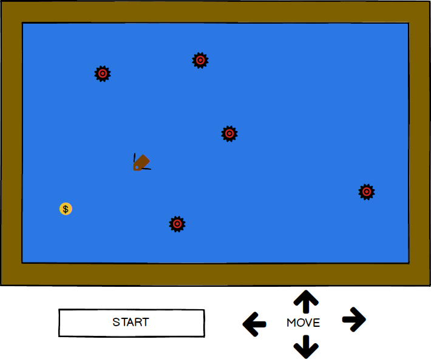

## Shipwrecked

### Background

It is the summer of 2004. 'Yeah' by Usher is topping music charts across the country, young people everywhere are Voting for Pedro, and Neopets reigns supreme among social networking sites over the rapidly-growing Myspace and still-fledgling Facebook.
Shipwrecked is a snapshot into this world, giving a decade-overdue makeover to a classic Neopets flash game. Play as a Shipwrecked
pirate collecting floating treasure from his creaky rowboat. Outwit heatseeking mines that move faster they closer they get to you.
Don't get wrecked!

### Functionality & MVP  

When playing Shipwrecked, users will:

- [ ] Be able to start and manipulate gameplay intiuitively with key inputs
- [ ] Navigate their character toward randomly generated coins
- [ ] Trick mines into crashing into each other, thus blowing each other up
- [ ] See how long they can last against an ever growing number of enemy mines

### Wireframes

This app will consist of a single page with simple instructions prominently displayed.

### Architecture and Technologies

- Canvas to display board and icons
- Vanilla JS and JQuery for DOM manipulation
- Webpack for bundling

### Implementation Timeline

**Day 1**: Learn Canvas, setup webpack. Goal is to have green Webpack and be showing icons on screen

**Day 2**: Set up OOP, class-based inhertiance models for moving objects (ship and mines), and static objects (coins).
Handle collision logic

**Day 3**: Make display visually appealing (mine explosion, water ripples, sound effects)

**Day 4**: Ensure user key input functions smoothly.

### Bonus features

- [ ] Adding rails/pg backend to keep track of all time high score
- [ ] Two player mode
